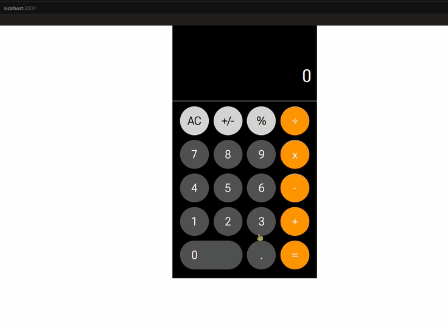

# Calculator built with React

This project is built as a learning project. \
The app's UI is based on iOS' calculator app's UI.

Currently the app is built with these functions:
- plus
- minus
- multiplication
- division
- sign changing
- percentage

## Planned updates
As of now the calculator app is not perfected, with the updates to be made listed below:
- division by zero
- chaining operations (e.g. `2+3+4`)
- different accent of colours on buttons while hovered/clicked 